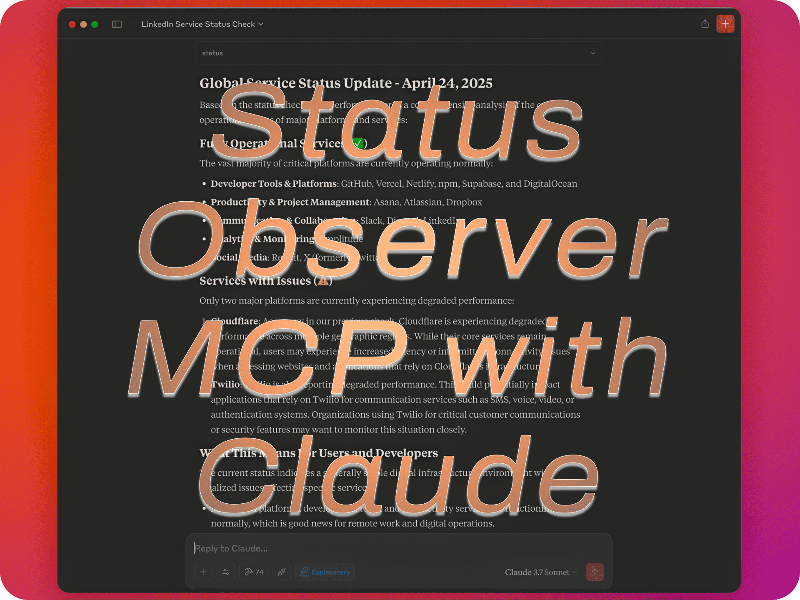

# MCP Status Observer

[](https://smithery.ai/server/imprvhub/mcp-status-observer)

<table style="border-collapse: collapse; width: 100%; table-layout: fixed;">
<tr>
<td style="padding: 15px; vertical-align: middle; border: none; text-align: center;">
  <a href="https://mseep.ai/app/imprvhub-mcp-status-observer">
    
  </a>
</td>
<td style="width: 40%; padding: 15px; vertical-align: middle; border: none;">An integration that allows Claude Desktop to monitor and query the operational status of major digital platforms including AI providers, cloud services, and developer tools using the Model Context Protocol (MCP).</td>
<td style="width: 60%; padding: 0; vertical-align: middle; border: none; min-width: 300px; text-align: center;">
  <a href="https://glama.ai/mcp/servers/@imprvhub/mcp-status-observer">
    
  </a>
</td>

</tr>
</table>

> [!IMPORTANT]
> This project is continuously updated with new platform integrations. If you're not seeing a service that should be available, or if Claude doesn't recognize a platform, please update by running `npm run build` from a freshly cloned repository. 
> 
> **Last updated**: 2026-09-26 — every platform is now read directly from its vendor's official status API. The intermediate helper service the previous version relied on has been retired, and OpenRouter and X were removed because neither exposes a status API reachable from a server (OpenRouter's returns 403 to non-browser clients; X no longer publishes one).

## Features

- Monitor world's most used digital platforms (GitHub, Slack, Discord, etc.)
- Track AI providers including OpenAI, Anthropic (Claude), and Gemini
- Get detailed status information for specific services with incident history
- Check status of specific components within each platform
- Real-time updates of service status with impact analysis
- Comprehensive incident tracking with resolution status and timelines
- Simple query interface with commands like `status --github` (the `--` prefix is optional)

## Demo

<p>
  <a href="https://www.youtube.com/watch?v=EV1ac0PMzKg">
    
  </a>
</p>

<details>
<summary> Timestamps </summary>

Click on any timestamp to jump to that section of the video

[**00:00**](https://www.youtube.com/watch?v=EV1ac0PMzKg&t=0s) - **LinkedIn Platform Status Assessment**  
Comprehensive analysis of LinkedIn's operational health, including detailed examination of core services such as LinkedIn.com, LinkedIn Learning, Campaign Manager, Sales Navigator, Recruiter, and Talent solutions. All systems confirmed fully operational with zero service disruptions.

[**00:20**](https://www.youtube.com/watch?v=EV1ac0PMzKg&t=20s) - **GitHub Infrastructure Status Overview**  
Detailed evaluation of GitHub's service availability, covering critical components including Git operations, API requests, Actions, Webhooks, Issues, Pull Requests, Packages, Pages, Codespaces, and Copilot functionality. Complete operational status confirmed across all GitHub services.

[**00:40**](https://www.youtube.com/watch?v=EV1ac0PMzKg&t=40s) - **Vercel Platform Reliability Analysis**  
In-depth examination of Vercel's global edge network and deployment infrastructure, featuring comprehensive status reporting on core services such as API, Dashboard, Builds, Serverless Functions, Edge Functions, and global CDN locations. All Vercel services verified operational across all regions.

[**01:08**](https://www.youtube.com/watch?v=EV1ac0PMzKg&t=68s) - **Cloudflare Network Status Examination**  
Extensive analysis of Cloudflare's global infrastructure status, detailing service availability across geographic regions and specific service components. Identified performance degradation in multiple regions (Africa, Asia, Europe, Latin America, Middle East, North America) while core services remain functional. Includes detailed assessment of regional data centers under maintenance and technical impact analysis.

[**01:46**](https://www.youtube.com/watch?v=EV1ac0PMzKg&t=106s) - **Global Operational Status Report**  
Consolidated overview of operational status across all major technology platforms and service providers, highlighting both fully operational services (GitHub, Vercel, Netlify, Asana, Atlassian, etc.) and services experiencing degraded performance (Cloudflare, Twilio). Includes strategic recommendations for organizations with dependencies on affected services.
</details>

## Requirements

- Node.js 20 or higher
- Claude Desktop
- Internet connection to access status APIs

## Installation

### Installing via Smithery

Install the packaged bundle from the [Smithery server page](https://smithery.ai/server/imprvhub/mcp-status-observer), or from the CLI:

```bash
npx -y @smithery/cli@latest mcp add imprvhub/mcp-status-observer --client claude
```

### Installing Manually
1. Clone or download this repository:
```bash
git clone https://github.com/imprvhub/mcp-status-observer
cd mcp-status-observer
```

2. Install dependencies:
```bash
npm install
```

3. Build the project:
```bash
npm run build
```

## Running the MCP Server

There are two ways to run the MCP server:

### Option 1: Running manually

1. Open a terminal or command prompt
2. Navigate to the project directory
3. Run the server directly:

```bash
node build/index.js
```

Keep this terminal window open while using Claude Desktop. The server will run until you close the terminal.

### Option 2: Auto-starting with Claude Desktop (recommended for regular use)

The Claude Desktop can automatically start the MCP server when needed. To set this up:

#### Configuration

The Claude Desktop configuration file is located at:

- **macOS**: `~/Library/Application Support/Claude/claude_desktop_config.json`
- **Windows**: `%APPDATA%\Claude\claude_desktop_config.json`
- **Linux**: `~/.config/Claude/claude_desktop_config.json`

Edit this file to add the Status Observer MCP configuration. If the file doesn't exist, create it:

```json
{
  "mcpServers": {
    "statusObserver": {
      "command": "node",
      "args": ["ABSOLUTE_PATH_TO_DIRECTORY/mcp-status-observer/build/index.js"]
    }
  }
}
```

**Important**: Replace `ABSOLUTE_PATH_TO_DIRECTORY` with the **complete absolute path** where you installed the MCP
  - macOS/Linux example: `/Users/username/mcp-status-observer`
  - Windows example: `C:\\Users\\username\\mcp-status-observer`

If you already have other MCPs configured, simply add the "statusObserver" section inside the "mcpServers" object. Here's an example of a configuration with multiple MCPs:

```json
{
  "mcpServers": {
    "otherMcp1": {
      "command": "...",
      "args": ["..."]
    },
    "otherMcp2": {
      "command": "...",
      "args": ["..."]
    },
    "statusObserver": {
      "command": "node",
      "args": [
        "ABSOLUTE_PATH_TO_DIRECTORY/mcp-status-observer/build/index.js"
      ]
    }
  }
}
```

The MCP server will automatically start when Claude Desktop needs it, based on the configuration in your `claude_desktop_config.json` file.

## Usage

1. Restart Claude Desktop after modifying the configuration
2. In Claude, use the `status` command to interact with the Status Observer MCP Server
3. The MCP server runs as a subprocess managed by Claude Desktop

## Available Commands

The Status Observer MCP provides a single tool named `status` with several commands:

| Command | Description | Parameters | Example |
|---------|-------------|------------|---------|
| `list` | List all available platforms | None | `status list` |
| `--[platform]` or `[platform]` | Get status for a specific platform | Platform id | `status --github`, `status github` |
| `--all` | Get status for all platforms | None | `status --all` |

## Supported Platforms

The Status Observer monitors 21 major digital platforms, each read from that vendor's own
status API:

### AI & Machine Learning (3)
- **OpenAI** - Leading AI services provider (ChatGPT, DALL-E, API)
- **Anthropic (Claude)** - AI assistant provider
- **Gemini / Vertex AI** - Google's multimodal AI platform, reported through Google Cloud incidents

### Cloud Infrastructure (4)
- **Google Cloud Platform** - Comprehensive cloud computing services
- **DigitalOcean** - Developer-focused cloud infrastructure
- **Vercel** - Frontend deployment and edge platform
- **Netlify** - Web development and deployment platform

### Developer Tools & Platforms (5)
- **Docker** - Container platform and services
- **GitHub** - Version control and collaboration platform
- **npm** - JavaScript package manager and registry
- **Atlassian** - Developer collaboration tools (Jira, Bitbucket, Confluence)
- **Supabase** - Open source backend platform (PostgreSQL, auth, storage)

### Productivity & Collaboration (4)
- **LinkedIn** - Professional networking platform
- **Slack** - Business communication and collaboration
- **Asana** - Team workflow and project management
- **Dropbox** - Cloud file storage and collaboration

### Web Infrastructure & Security (3)
- **Cloudflare** - Web infrastructure, CDN, and security
- **Discord** - Developer community and communication platform
- **Reddit** - Social news and developer community platform

### Analytics & Business Tools (1)
- **Amplitude** - Product analytics platform

## Example Usage

Here are various examples of how to use the Status Observer with Claude:

### Direct Commands:

```
# AI Platforms
status --openai
status --anthropic
status --gemini

# Cloud Infrastructure
status --gcp
status --vercel
status --digitalocean
status --netlify

# Developer Tools
status --docker
status --github
status --atlassian
status --supabase
status --npm

# Productivity & Social
status --linkedin
status --slack
status --dropbox

# Web Infrastructure
status --cloudflare
status --discord

# All platforms
status --all
status list
```

### Preview


### Natural Language Prompts:

You can also interact with the MCP using natural language. Claude will interpret these requests and use the appropriate commands:

- "Could you check if OpenAI is having any API issues right now?"
- "What's the status of OpenAI's ChatGPT service?"
- "Has there been any recent incidents with Claude or the Anthropic API?"
- "Is Google Cloud Platform experiencing any outages in my region?"
- "Check if Docker Hub is operational for automated builds"
- "What's the current status of LinkedIn's Sales Navigator?"
- "Can you tell me if Google's Gemini AI is experiencing any service disruptions?"
- "Show me the status of all AI platforms including Anthropic and OpenAI"
- "Are there any active incidents affecting GitHub Actions or Git operations?"
- "Check the overall health of Vercel and Netlify for my deployment pipeline"
- "Has Supabase had any recent database or authentication issues?"
- "What's the status of all major platforms right now?"


## Development

Run the test suite (no network required):

```bash
npm install
npm run build
npm test
```

## Troubleshooting

### "Server disconnected" error
If you see the error "MCP Status Observer: Server disconnected" in Claude Desktop:

1. **Verify the server is running**:
   - Open a terminal and manually run `node build/index.js` from the project directory
   - If the server starts successfully, use Claude while keeping this terminal open

2. **Check your configuration**:
   - Ensure the absolute path in `claude_desktop_config.json` is correct for your system
   - Double-check that you've used double backslashes (`\\`) for Windows paths
   - Verify you're using the complete path from the root of your filesystem

### Tools not appearing in Claude
If the Status Observer tools don't appear in Claude:
- Make sure you've restarted Claude Desktop after configuration
- Check the Claude Desktop logs for any MCP communication errors
- Ensure the MCP server process is running (run it manually to confirm)
- Verify that the MCP server is correctly registered in the Claude Desktop MCP registry

### Checking if the server is running
To check if the server is running:

- **Windows**: Open Task Manager, go to the "Details" tab, and look for "node.exe"
- **macOS/Linux**: Open Terminal and run `ps aux | grep node`

If you don't see the server running, start it manually or use the auto-start method.

## Contributing

### Adding New Status APIs

Contributors can easily add support for additional platforms by modifying the `initializePlatforms` method in `src/index.ts`. The process is straightforward:

1. Identify a platform's status API endpoint
2. Most vendors publish an Atlassian Statuspage, whose `/api/v2/summary.json` shape is
   already handled. Adding one is a single line in the `STATUSPAGE` table — the origin only,
   the path is appended for you:

```typescript
['newservice', 'New Service', 'Description of the service', 'https://status.newservice.com'],
```

That is the whole change: the generic renderer reports overall status, any non-operational
components, active incidents and scheduled maintenance.

### Non-Statuspage vendors

Two shapes are special-cased because they are not Statuspage: Slack's `api/v2.0.0/current`
and Google Cloud's `incidents.json`. If a vendor publishes something else again:

1. Add a value to the `ApiKind` union
2. Add a `render<Kind>()` method returning formatted text
3. Add the matching `case` in `getPlatformStatus()` and `getQuickPlatformStatus()`

Prefer an official vendor endpoint. An earlier version of this server proxied several
platforms through a hosted helper that scraped their HTML status pages; when that helper went
offline, ten platforms silently broke. Scraped or proxied sources are not accepted here.

### Platform Categories

When adding new platforms, consider organizing them into logical categories:
- **AI/ML**: OpenAI, Anthropic, Gemini
- **Cloud Infrastructure**: GCP, AWS, Azure, DigitalOcean
- **Developer Tools**: GitHub, GitLab, Docker, npm
- **Productivity**: Slack, Microsoft 365, Google Workspace
- **Web Infrastructure**: Cloudflare, Fastly, Akamai

## License

This project is licensed under the Mozilla Public License 2.0 - see the [LICENSE](https://github.com/imprvhub/mcp-status-observer/blob/main/LICENSE) file for details.

## Related Links

- [Model Context Protocol](https://modelcontextprotocol.io/)
- [Claude Desktop](https://claude.ai/download)
- [MCP Series](https://github.com/mcp-series)

## Changelog

- **2026-09-26**: Every platform now reads its vendor's official status API. Retired the hosted
  helper service that had gone offline, taking 10 platforms with it (Anthropic, OpenAI, Docker,
  Atlassian, Supabase, LinkedIn, GCP, Gemini, OpenRouter, X). Eight were restored against
  official endpoints; OpenRouter and X were removed for lack of a server-reachable status API.
  Component output now names only what is not operational instead of listing every component,
  and active incidents and scheduled maintenance are reported. Dependencies updated and the
  build fixed (it no longer compiled against current MCP SDK releases).
- **2025-09-12**: Added OpenRouter integration with RSS incident tracking and detailed impact analysis
- **2025-04-26**: Added Docker status integration with comprehensive component monitoring
- **2025-03-15**: Enhanced GCP regional status reporting with incident correlation
- **2025-02-28**: Added Anthropic and Gemini AI platform monitoring
- **2025-01-20**: Initial release with core platform support (GitHub, Vercel, Cloudflare, etc.)

---

*Built for the developer community by [imprvhub](https://github.com/imprvhub)*
